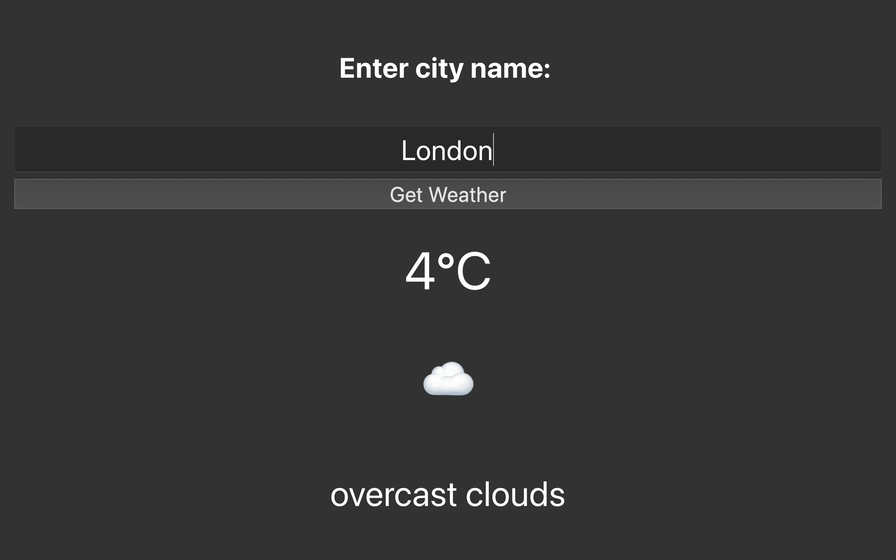

# Py-weatherapp
WeatherApp 🌦️

A simple and user-friendly desktop Weather Application built using Python, PyQt5, and the OpenWeatherMap API.
The app allows users to enter a city name and instantly view the temperature, weather description, and an emoji representing real-time weather conditions.

📌 Features

🌍 Get real-time weather for any city

🌡️ Temperature in Celsius

😄 Emoji-based weather icons (sun, rain, snow, fog, storm, etc.)

⚠️ Proper error handling for invalid cities, API issues, or no internet

🖥️ Clean and minimal PyQt5 interface

🎨 Custom styled UI using Qt Style Sheets

🛠️ Technologies Used

Python 3

PyQt5

Requests (HTTP library)

OpenWeatherMap API

📥 Installation

Install required libraries:

pip install PyQt5 requests

Download or clone the project:

git clone https://github.com/soumyajit710/Py-weatherapp

Navigate to the project folder:

cd WeatherApp

Run the application:

python main.py

🔑 API Key Setup

This app uses the OpenWeatherMap API.

You must replace the placeholder API key in the code:

api_key = "349ede72de054ee61150182c7733acdb"

Get your free API key here:
https://openweathermap.org/api

📂 Project Structure
WeatherApp/
│── main.py        # Main application code
│── README.md      # Project documentation

🧠 How It Works

User enters a city name

App sends a request to OpenWeatherMap

Weather data (temperature, weather ID, description) is received

Weather ID is converted into a matching emoji:

☀️ Clear

🌧️ Rain

❄️ Snow

⛈️ Thunderstorm

☁️ Clouds

UI updates instantly with temperature, description, and emoji

⚠️ Error Handling Covered

The app displays clear messages for:

❌ City not found (404)

🔑 Invalid API key (401)

🚫 No internet connection

🕒 Request timeout

🛑 Server issues (500+, 502, 503)

🔄 Too many redirects

Error messages are shown directly in the GUI.

📸 Screenshot

📄 License

This project is free to use, modify, and learn from.